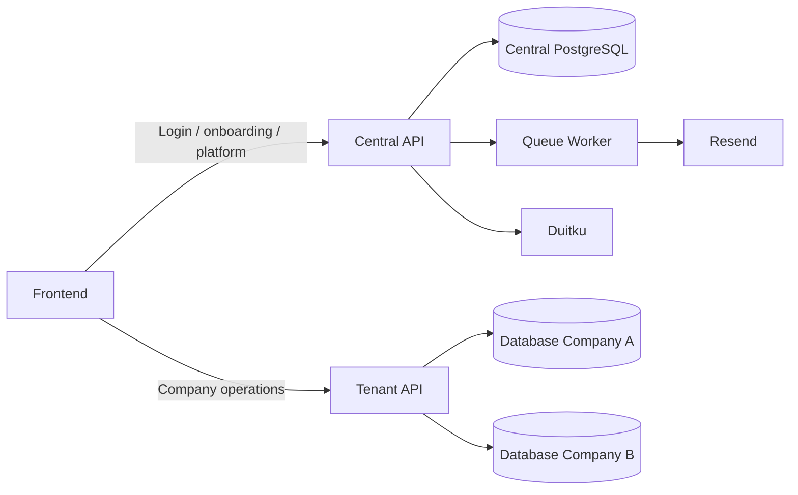
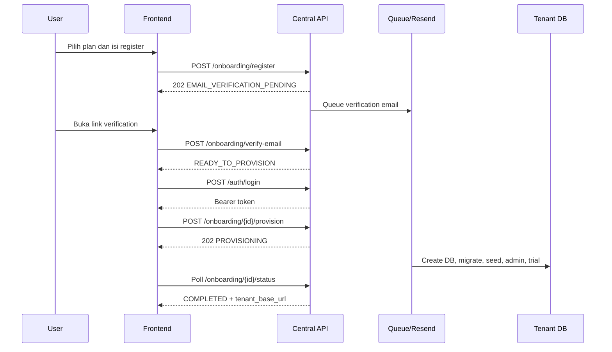
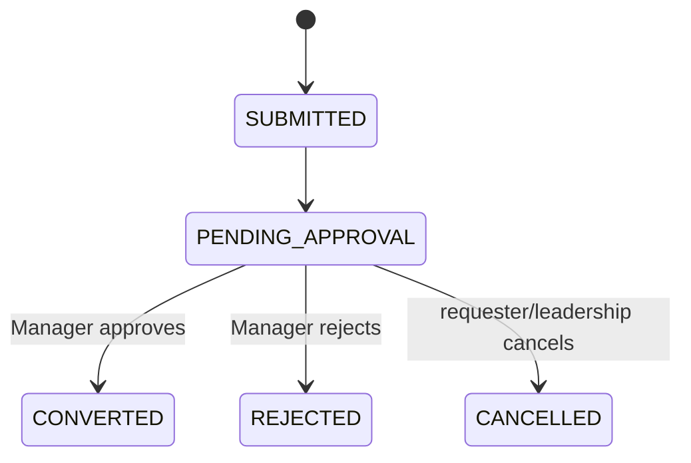
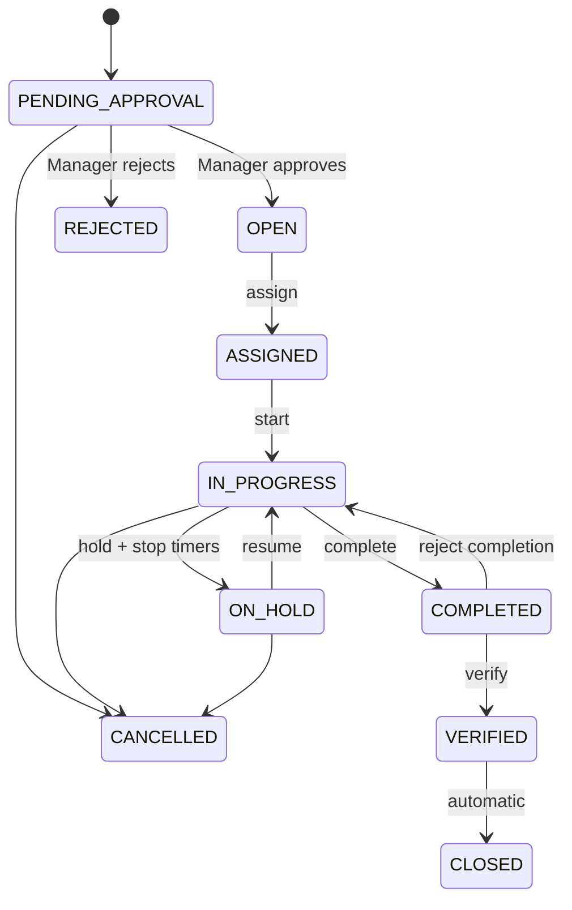

# AITOMA CMMS Backend — Frontend Handoff Guide

Dokumen ini adalah acuan utama frontend developer untuk mendesain, melakukan slicing, dan mengintegrasikan aplikasi AITOMA CMMS dengan repository `backend-cmms`. Dokumen menjelaskan kontrak backend; keputusan visual tetap menjadi tanggung jawab frontend developer.

## 1. Sumber kebenaran

1. Dokumen ini: konsep produk, flow, role, status, dan panduan integrasi.
2. Swagger UI: kontrak endpoint aktual, parameter, contoh payload, security, feature gate, dan response code.
3. `docs/postman/AITOMA_CMMS_API_V1_BY_FEATURE.postman_collection.json`: referensi request berdasarkan fitur.
4. `docs/postman/AITOMA_CMMS_API_V1.postman_collection.json`: regression Happy Flow yang dijalankan berurutan.
5. `docs/postman/AITOMA_CMMS_LOCAL.postman_environment.json`: konfigurasi Postman local.
6. `routes/api.php` dan `routes/tenant.php`: sumber akhir bila ada keraguan tentang route.

Swagger local:

- UI: `http://localhost:8000/api/documentation`
- OpenAPI JSON: `http://localhost:8000/api/documentation/openapi.json`

Jangan memakai koleksi Happy Flow sebagai struktur menu frontend. Koleksi itu dibuat untuk regression test dan mempunyai script yang membuat serta menyimpan data otomatis. Gunakan koleksi **By Feature** untuk pencarian endpoint harian.

## 2. Gambaran sistem

Backend menggunakan Laravel 13, PHP 8.3+, PostgreSQL, Laravel Sanctum bearer token, `stancl/tenancy`, queue database, Resend, Duitku, dan ULID sebagai primary key.

| Konteks | Contoh base URL local | Digunakan untuk |
|---|---|---|
| Central | `http://localhost:8000/api/v1` | login, `auth/me`, public plan, onboarding, Super Admin, callback Duitku |
| Tenant | `http://acme.localhost:8000/api/v1` | site, user company, team, asset, request, WO, PM, notifikasi, billing company |

Database central menyimpan identitas global, tenant directory, domain, membership, plan, subscription, invoice, dan payment. Database tenant menyimpan data operasional company.



Satu bearer token hasil login central dipakai pada central maupun tenant API. Database tenant ditentukan oleh hostname, bukan request body atau header tenant ID.

## 3. Menjalankan backend local

Prasyarat: PHP 8.3+, Composer 2, PostgreSQL aktif, user PostgreSQL dapat membuat/menghapus database tenant, serta extension PHP PostgreSQL dan cURL aktif.

```powershell
Copy-Item .env.example .env
composer install
php artisan key:generate
php artisan migrate
php artisan cmms:seed-central
php artisan cmms:admin:create admin@aitoma.id --name="AITOMA Admin"
```

Jalankan tiga proses saat development:

```powershell
php artisan serve --host=127.0.0.1 --port=8000
php artisan queue:work --tries=3 --timeout=900
php artisan schedule:work
```

- `serve`: HTTP API dan Swagger.
- `queue:work`: email verifikasi dan provisioning tenant async.
- `schedule:work`: PM generator setiap lima menit dan invoice generator harian.

Konfigurasi frontend integration:

```dotenv
APP_URL=http://localhost:8000
FRONTEND_URL=http://localhost:3000
CORS_ALLOWED_ORIGINS=http://localhost:3000
TENANCY_CENTRAL_DOMAINS=127.0.0.1,localhost
TENANCY_TENANT_DOMAIN_SUFFIX=localhost
TENANCY_TENANT_SCHEME=http
TENANCY_TENANT_PORT=8000
```

Jika frontend memakai origin lain, tambahkan origin tepatnya ke `CORS_ALLOWED_ORIGINS`, dipisahkan koma. Backend memakai bearer token dan `supports_credentials=false`; frontend tidak perlu cookie credentials.

## 4. Kontrak HTTP umum

Header JSON:

```http
Accept: application/json
Content-Type: application/json
Authorization: Bearer <token>
```

Jangan set `Content-Type` sendiri saat upload `multipart/form-data`; browser membuat boundary otomatis.

Endpoint idempotent tertentu memerlukan `Idempotency-Key`. Gunakan UUID/ULID unik per operasi bisnis. Pakai kembali key yang sama hanya ketika retry request dengan payload sama.

Single resource/action:

```json
{"data":{"id":"01ARZ3NDEKTSV4RRFFQ69G5FAV"}}
```

Paginated collection:

```json
{
  "data": [],
  "meta": {"current_page":1,"last_page":1,"per_page":20,"total":0},
  "links": {"first":"...page=1","last":"...page=1","prev":null,"next":null}
}
```

Delete/archive dan logout umumnya mengembalikan `204 No Content`. Jangan memanggil `response.json()` untuk status 204.

Error:

```json
{
  "error": {
    "code": "VALIDATION_FAILED",
    "message": "The submitted data is invalid.",
    "details": {"email":["The email field is required."]}
  }
}
```

Gunakan `error.code` untuk branching dan `error.message` sebagai fallback. Jangan branching dari teks message.

| HTTP | Makna frontend |
|---:|---|
| 200/201 | sukses / resource dibuat |
| 202 | diterima dan diproses async; mulai polling |
| 204 | sukses tanpa body |
| 401 | token invalid; hapus session dan arahkan login |
| 402 | subscription tidak tersedia; arahkan Company Admin ke billing |
| 403 | role, feature, tenant status, password, atau policy melarang |
| 404 | tidak ada atau disembunyikan karena di luar tenant/site scope |
| 409 | state transition, idempotency, limit, atau konflik bisnis |
| 422 | validasi field/payload |
| 429 | rate limit |
| 500/502/503 | server/provider gagal; sediakan retry aman |

Error bootstrap penting: `PASSWORD_CHANGE_REQUIRED`, `EMAIL_VERIFICATION_REQUIRED`, `TENANT_INACTIVE`, `SUBSCRIPTION_REQUIRED`, `FEATURE_NOT_INCLUDED`, `ROLE_FORBIDDEN`, dan `PLAN_LIMIT_REACHED`.

## 5. Authentication dan session

Login selalu melalui central:

```http
POST {{centralBaseUrl}}/auth/login
```

```json
{"email":"user@example.com","password":"password","device_name":"frontend-web"}
```

`device_name` hanya label token/session, bukan hardware ID. Response berisi `token`, `token_type`, `must_change_password`, dan profil user central.

Setelah login, panggil `GET {{centralBaseUrl}}/auth/me`. Response `memberships` menyediakan `tenant_id`, `tenant_name`, `tenant_status`, `role_key`, dan `domain`.

Pemilihan company:

- membership kosong: arahkan ke onboarding;
- satu membership: dapat dipilih otomatis;
- lebih dari satu: tampilkan company switcher;
- tenant URL local: `http://{domain}:8000/api/v1`;
- token central yang sama dikirim ke tenant URL;
- jangan mengirim `tenant_id` untuk memilih database.

Backend belum mempunyai refresh-token endpoint dan tidak memakai HttpOnly cookie. Memory storage paling aman tetapi hilang saat reload. Bila memilih `localStorage`, frontend wajib memperketat CSP dan sanitasi karena risiko XSS.

Logout: `POST {{centralBaseUrl}}/auth/logout`. Setelah 204, hapus token, membership, tenant base URL, dan semua cache user.

### Mandatory password change

Akun buatan Super Admin/Company Admin memakai temporary password. Login dapat berhasil dengan `must_change_password=true`, tetapi tenant API ditolak sampai password diganti.

```http
PUT {{centralBaseUrl}}/auth/password
```

```json
{"current_password":"Temporary123","password":"NewPassword123","password_confirmation":"NewPassword123"}
```

Password minimal delapan karakter serta mengandung huruf dan angka.

## 6. Self-service onboarding

Flow ini membuat akun owner, memverifikasi email, membuat tenant dan database, menjalankan migration, membuat Company Admin membership, serta memulai trial.



Urutan endpoint:

1. `GET /public/plans` dan optional `GET /public/plans/{plan}`.
2. `POST /onboarding/register` dengan `Idempotency-Key`.
3. Tampilkan “check your email”.
4. Optional `POST /onboarding/resend-verification`.
5. Link frontend mengambil query token dan memanggil `POST /onboarding/verify-email`.
6. Login central.
7. Optional `GET/PATCH /onboarding/{onboarding}` sebelum provisioning.
8. `POST /onboarding/{onboarding}/provision` dengan `Idempotency-Key`.
9. Poll `GET /onboarding/{onboarding}/status` setiap 2–5 detik.
10. Saat `COMPLETED`, simpan `tenant_base_url`, refresh `auth/me`, lalu masuk tenant app.

| Status | Perilaku UI |
|---|---|
| `EMAIL_VERIFICATION_PENDING` | confirmation screen + resend |
| `READY_TO_PROVISION` | review company/plan + start trial |
| `PLAN_SELECTION_REQUIRED` | kembali ke pemilihan plan |
| `PROVISIONING` | progress + polling; jangan submit key baru |
| `COMPLETED` | masuk tenant app |
| `PROVISIONING_FAILED` | error aman + retry |
| `EXPIRED` | mulai registrasi baru |
| `CANCELLED` | flow selesai/dibatalkan |

`POST /retry` hanya untuk `PROVISIONING_FAILED`. `POST /cancel` hanya sebelum tenant dibuat. Endpoint provision mengembalikan 202 karena proses berjalan di queue worker.

## 7. Inisialisasi aplikasi frontend

Pisahkan dua HTTP client:

- `centralApi`: central base URL;
- `tenantApi`: company base URL aktif.

```ts
type Session = {
  token: string;
  centralBaseUrl: string;
  tenantBaseUrl?: string;
  selectedTenantId?: string;
};

async function bootstrapApp(session: Session) {
  const me = await centralApi.get('/auth/me');
  if (me.data.user.must_change_password) return routeTo('/change-password');

  const membership = selectStoredOrFirstMembership(me.data.memberships);
  if (!membership) return routeTo('/onboarding');

  session.selectedTenantId = membership.tenant_id;
  session.tenantBaseUrl = resolveTenantBaseUrl(membership.domain);
  return loadTenantBootstrapData();
}
```

Interceptor harus menambahkan `Accept`, bearer token, tidak parsing JSON pada 204, menormalisasi error, membersihkan session pada 401, dan tidak otomatis retry mutation tanpa idempotency.

## 8. Authorization, role, dan visibility

Backend tetap menjadi sumber kebenaran. Menyembunyikan tombol hanya untuk UX, bukan pengganti authorization.

`SUPER_ADMIN` mengakses `/platform/*`. Tenant user biasa tidak boleh melihat menu platform.

| Company role | Ruang lingkup data | Kemampuan utama |
|---|---|---|
| `COMPANY_ADMIN` | seluruh site company | master data, user, team, asset, PM, billing |
| `MANAGER` | `primary_site_id` | approve request/direct WO, kelola Supervisor/Technician satu site |
| `SUPERVISOR` | `primary_site_id` | kelola lokasi/team/asset/PM dan mengawasi WO satu site |
| `TECHNICIAN` | site dari team aktif; WO hanya assignment sendiri | membuat request dan menjalankan WO assignment |
| `OPERATOR` | asset assignment; request/WO hanya miliknya | membuat request/direct WO dan menjadi requester/verifier |
| `VIEWER` | `primary_site_id` | read-only |

Aturan penting:

- Manager/Supervisor/Viewer tidak dapat membaca resource di luar primary site.
- Technician hanya melihat WO dengan `current_assignee_id` dirinya, bukan seluruh WO tim/site.
- Operator hanya melihat request/WO miliknya dan asset dengan assignment aktif.
- Resource di luar scope mengembalikan 404, bukan 403.
- Manager hanya dapat membuat/mengubah Supervisor atau Technician pada primary site yang sama.
- Company Admin dapat mengelola seluruh site/role, tetapi Company Admin aktif terakhir tidak dapat dinonaktifkan/didemote.
- User selain Company Admin wajib memiliki `primary_site_id`.
- Viewer tidak dapat menulis comment atau upload/delete attachment.

Filter `site_id` hanya untuk UX. Backend tetap menerapkan scope sendiri.

### Plan feature dan limit

Feature key:

- `core.assets`
- `core.requests`
- `core.work_orders`
- `core.teams`
- `core.notifications`
- `core.preventive_maintenance`
- `core.billing_gateway`
- `limit.users`, `limit.assets`, `limit.sites`

Feature yang tidak termasuk plan mengembalikan `FEATURE_NOT_INCLUDED`; limit create mengembalikan `PLAN_LIMIT_REACHED`.

Backend belum memiliki endpoint tenant khusus `/entitlements` yang memberikan seluruh feature dan limit efektif. Public plan detail menyediakan feature untuk onboarding, sedangkan Super Admin melihat feature pada plan. Sementara ini UI tetap wajib menangani `FEATURE_NOT_INCLUDED`. Endpoint bootstrap entitlement perlu ditambahkan sebelum navigation berbasis paket dianggap final.

## 9. Struktur screen yang disarankan

Public/central:

- login, pricing/public plans, registration;
- check email/resend dan verification result;
- onboarding review/start trial, provisioning progress/retry;
- company switcher dan mandatory password change.

Tenant app:

- dashboard dan notifications;
- request list/detail/create;
- WO list/detail/create/execution/timer;
- asset list/detail, categories, sites, locations;
- company users dan maintenance teams;
- PM templates, schedules, occurrences;
- subscription, invoice, payment untuk Company Admin.

Super Admin:

- plan version/editor/feature assignment/publish;
- tenant list/detail/provision/retry/subscription;
- Duitku configuration/channels/manual confirmation;
- platform audit logs.

## 10. Maintenance Request

Semua request baru membutuhkan persetujuan Maintenance Manager.



`SUBMITTED` biasanya hanya tercatat di history; row segera berada pada `PENDING_APPROVAL`.

- Create role: Company Admin, Manager, Supervisor, Technician, atau Operator. Viewer tidak dapat membuat.
- Approval/rejection hanya `MANAGER` dan self-approval dilarang.
- Approval mengubah request menjadi `CONVERTED` dan membuat WO; frontend tidak perlu membuat WO lagi.

| Method | Path | Fungsi |
|---|---|---|
| GET | `/requests` | list scoped; filter `status`, `page`, `per_page` |
| POST | `/requests` | membuat request |
| GET | `/requests/{id}` | detail + status history |
| POST | `/requests/{id}/approve` | Manager approve dan convert |
| POST | `/requests/{id}/reject` | Manager reject dengan `reason` |
| POST | `/requests/{id}/cancel` | requester/leadership cancel dengan `reason` |

Tidak ada endpoint edit/delete Maintenance Request pada MVP.

## 11. Work Order

Direct WO maupun WO hasil request memerlukan approval Manager sebelum eksekusi.



Aturan UI:

- `PATCH /work-orders/{id}` hanya sebelum pekerjaan dimulai: `PENDING_APPROVAL`, `OPEN`, atau `ASSIGNED`.
- Setelah pernah `IN_PROGRESS`, jangan tampilkan edit form.
- Assignment hanya pada `OPEN`/`ASSIGNED`, setelah approval dan sebelum work starts.
- Claim/release WO tidak digunakan.
- `acknowledge` hanya mencatat `acknowledged_at`; status tidak berubah.
- `start` mengubah `ASSIGNED` menjadi `IN_PROGRESS`.
- `timer/start` bukan pengganti `start`; timer hanya boleh saat `IN_PROGRESS`.
- Satu technician hanya dapat mempunyai satu labor timer aktif walaupun WO berbeda.
- `hold` otomatis menghentikan timer aktif; WO `ON_HOLD` tidak dapat memulai timer.
- `complete` membutuhkan `completion_note`.
- `verify` menjalankan `COMPLETED → VERIFIED → CLOSED` otomatis.
- `reject-completion` mengembalikan WO ke `IN_PROGRESS`.
- Technician hanya mengeksekusi WO yang ditugaskan kepadanya.

Detail WO menyertakan `status_history`, `assignments`, `labor_entries`, `comments`, dan `attachments`.

| Method | Path | Body utama |
|---|---|---|
| GET/POST | `/work-orders` | list/create |
| GET/PATCH | `/work-orders/{id}` | detail/edit sebelum start |
| POST | `/work-orders/{id}/approve` | optional `note`; Manager |
| POST | `/work-orders/{id}/reject` | `reason`; Manager |
| POST | `/work-orders/{id}/assign` | `team_id` dan/atau `assignee_id` |
| POST | `/work-orders/{id}/acknowledge` | tanpa body |
| POST | `/work-orders/{id}/start` | tanpa body |
| POST | `/work-orders/{id}/timer/start` | optional `notes` |
| POST | `/work-orders/{id}/timer/stop` | optional `notes` |
| POST | `/work-orders/{id}/hold` | `reason` |
| POST | `/work-orders/{id}/resume` | optional `note` |
| POST | `/work-orders/{id}/complete` | `completion_note` |
| POST | `/work-orders/{id}/reject-completion` | `reason` |
| POST | `/work-orders/{id}/verify` | tanpa body |
| POST | `/work-orders/{id}/cancel` | `reason` |

Gunakan response action untuk mengganti entity di state, lalu invalidate list/detail/dashboard/notifications terkait.

## 12. Attachment dan comment

Attachment opsional dan hanya mendukung entity `REQUEST` atau `WORK_ORDER`.

`POST /attachments` memakai multipart fields:

- `entity_type`: `REQUEST` atau `WORK_ORDER`;
- `entity_id`: ULID;
- `media_role`: `REQUEST`, `BEFORE`, `AFTER`, `OTHER`;
- `file`: JPEG, PNG, WebP, MP4, atau QuickTime; maksimum 50 MB.

Flow paling sederhana: buat request/WO dahulu, lalu upload memakai ID response. Upload gagal tidak membatalkan entity; tampilkan progress/error/retry per file.

Download melalui `GET /attachments/{id}/download` dengan bearer token. Jangan memakai `storage_path` sebagai public URL. Fetch sebagai Blob untuk preview, buat object URL, kemudian revoke.

Viewer hanya dapat download attachment dalam scope. Comment dibuat melalui `POST /comments` dan dibaca dari detail Request/WO. Belum ada edit/delete comment atau standalone comment list.

## 13. Organization, users, team, dan asset

| Resource | Endpoint CRUD/action |
|---|---|
| Site | `GET/POST /sites`, `GET/PATCH/DELETE /sites/{id}` |
| Location | `GET/POST /locations`, `GET/PATCH/DELETE /locations/{id}` |
| Company user | `GET/POST /users`, `GET/PATCH /users/{id}` |
| Team | `GET/POST /teams`, `GET/PATCH/DELETE /teams/{id}` |
| Team member | `POST /teams/{id}/members`, `DELETE /teams/{id}/members/{tenantUserId}` |
| Asset category | `GET/POST /asset-categories`, `GET/PATCH/DELETE /asset-categories/{id}` |
| Asset | `GET/POST /assets`, `GET/PATCH/DELETE /assets/{id}` |
| Asset operator | `GET/POST /assets/{id}/operators`, `DELETE /assets/{id}/operators/{assignmentId}` |

`DELETE` master data umumnya archive/soft-delete. Gunakan `include_archived=true` jika endpoint mendukungnya.

Relasi form yang divalidasi backend:

- parent location harus satu site;
- team supervisor harus Supervisor aktif satu site;
- team member harus user aktif satu site;
- asset location harus berada pada site asset;
- asset operator harus Operator aktif pada site asset;
- PM team/technician/template/schedule/asset harus satu site.

Untuk selector Technician/Supervisor/Operator gunakan `GET /users?role=...&status=ACTIVE`. Asset detail juga memuat WO terbaru yang sudah mengikuti scope user.

## 14. Preventive Maintenance Lite

PM terdiri dari template, schedule, dan occurrence. Seluruhnya site-scoped; template baru wajib mempunyai `site_id`.

- `FIXED`: next due mengikuti jadwal/generation sebelumnya.
- `COMPLETION_BASED`: next due dihitung dari completion terakhir.
- Trigger mendukung `DAY`, `WEEK`, `MONTH`, `YEAR`, interval value, optional day, local time, dan IANA timezone.
- Update trigger/timezone/start date/schedule mode menghitung ulang `next_due_at`. Gunakan response server, jangan menghitung sendiri.

Status template: `DRAFT`, `ACTIVE`, `RETIRED`.

Status schedule: `DRAFT`, `ACTIVE`, `PAUSED`, `RETIRED`.

Status occurrence: `PENDING`, `GENERATED`, `COMPLETED`, `SKIPPED`, `CANCELLED`, `HELD`.

Endpoint:

- `GET/POST /pm/templates`
- `GET/PATCH/DELETE /pm/templates/{id}`
- `GET/POST /pm/schedules`
- `GET/PATCH/DELETE /pm/schedules/{id}`
- `POST /pm/schedules/{id}/pause`
- `POST /pm/schedules/{id}/resume`
- `GET /pm/occurrences`

Occurrence dibuat scheduler backend. Belum ada detail/mutation occurrence endpoint.

## 15. Notifications dan dashboard

- `GET /notifications?unread_only=true&per_page=20`
- `POST /notifications/{id}/read`
- `POST /notifications/read-all`
- `GET /dashboard/summary`

Backend belum memakai WebSocket/SSE. Poll 30–60 detik saat tab aktif dan refetch setelah mutation penting; jangan polling agresif saat tab tersembunyi. Dashboard sudah role-scoped, sehingga angka Technician/Operator bukan angka global company.

## 16. Billing dan Duitku

Tenant billing hanya untuk `COMPANY_ADMIN`:

- `GET /billing/subscription`
- `GET /billing/invoices`
- `GET /billing/invoices/{id}`
- `GET /billing/payment-channels`
- `POST /billing/invoices/{id}/payments`
- `GET /billing/payments/{id}`
- `POST /billing/payments/{id}/check-status`

Create payment:

```json
{
  "payment_channel_id": "01ARZ3NDEKTSV4RRFFQ69G5FAV",
  "idempotency_key": "pay-invoice-id-attempt-001"
}
```

Setelah create, simpan payment ID; bila ada `redirect_url`, arahkan user; tampilkan `PENDING`; lalu gunakan check status secara terkendali. Callback Duitku memperbarui payment/invoice. Jangan membuat signature atau memanggil Duitku langsung dari browser.

Status invoice: `DRAFT`, `ISSUED`, `PENDING`, `PAID`, `VOID`, `OVERDUE`, `FAILED`.

Status payment: `CREATED`, `PENDING`, `PAID`, `FAILED`, `EXPIRED`, `CANCELLED`.

Invoice dibuat scheduler harian. Belum ada PDF invoice/download endpoint. Frontend boleh menyediakan printable view, tetapi PDF resmi membutuhkan endpoint backend tambahan.

Konfigurasi provider/channel dan manual confirmation hanya Super Admin. Jangan tampilkan merchant secret di frontend.

## 17. Super Admin plan dan tenant management

Urutan plan:

1. buat `DRAFT`;
2. edit field plan;
3. assign feature melalui `PUT /platform/plans/{plan}/features`;
4. publish;
5. published plan immutable;
6. buat version draft baru untuk perubahan berikutnya.

Plan endpoints:

- `GET/POST /platform/plans`
- `GET/PUT/PATCH/DELETE /platform/plans/{id}`
- `PUT /platform/plans/{id}/features`
- `POST /platform/plans/{id}/publish`

Hanya draft yang tidak dipakai subscription dapat dihapus.

Tenant endpoints:

- `GET/POST /platform/tenants`
- `GET/PATCH /platform/tenants/{id}`
- `POST /platform/tenants/{id}/retry-provisioning`
- `PUT /platform/tenants/{id}/subscription`

Self-service dan Super Admin memakai provisioning service yang sama. Perbedaannya hanya actor, sinkron/asinkron, dan sumber input.

## 18. Data type dan formatting

- Semua ID adalah string ULID; jangan parse sebagai number.
- Timestamp adalah instant ber-timezone; parse sebagai date-time.
- PM `start_date`/`end_date` adalah `YYYY-MM-DD`.
- PM `fixed_local_time` adalah `HH:mm` dalam timezone schedule.
- Harga saat ini IDR. Jangan membagi nominal dengan 100.
- Nullable field dapat benar-benar `null`.
- Status/role gunakan union type tetapi sediakan fallback label untuk nilai baru.

```ts
type Ulid = string;
type ApiItem<T> = { data: T };

type ApiPage<T> = {
  data: T[];
  meta: { current_page: number; last_page: number; per_page: number; total: number };
  links: { first: string; last: string; prev: string | null; next: string | null };
};

type ApiFailure = {
  error: {
    code: string;
    message: string;
    details: Record<string, string[] | unknown>;
  };
};
```

## 19. Cache dan invalidation

Gunakan query key `[tenantId, feature, filters, page]`. `tenantId` wajib ada agar data tidak terlihat silang saat company switch.

Invalidation minimum:

- request mutation: request list/detail, WO list bila approve, dashboard, notifications;
- WO mutation: WO list/detail, asset detail, dashboard, notifications;
- timer: WO detail;
- asset/team/user/site: list/detail dan selector terkait;
- PM: template/schedule/occurrence list;
- payment: invoice list/detail, payment detail, subscription.

Hindari optimistic update untuk transition WO, approval, payment, dan provisioning. Gunakan response backend karena lock/state dapat berubah.

## 20. Checklist action frontend

Sebelum menampilkan action, evaluasi:

1. context central/tenant;
2. platform/company role;
3. tenant aktif dan `must_change_password`;
4. plan feature jika tersedia;
5. resource status;
6. ownership/requester;
7. technician assignment;
8. site scope;
9. pending request untuk mencegah double submit.

Walaupun tombol terlihat, tetap tangani 403/404/409 karena state dapat berubah dari device lain.

## 21. Keterbatasan backend MVP

- belum ada refresh token atau cookie session;
- belum ada forgot/reset-password publik;
- belum ada endpoint tenant bootstrap untuk tenant-user profile + effective entitlements;
- belum ada endpoint master feature catalog terpisah untuk checkbox Super Admin;
- belum ada PDF invoice generator/download;
- belum ada WebSocket/SSE notification;
- belum ada standalone comments list/edit/delete;
- belum ada request edit/delete;
- WO tidak mempunyai delete dan immutable setelah work starts;
- belum ada PM occurrence detail/action;
- attachment default masih local filesystem;
- tidak ada automatic recurring card debit;
- inventory, vendor, checklist lanjutan, predictive monitoring, dan escalation di luar MVP.

Jangan membuat UI yang mengesankan fitur tersebut sudah berfungsi tanpa penambahan endpoint.

## 22. Urutan implementasi frontend

1. HTTP client, error normalizer, token store, central/tenant switching.
2. Login, `auth/me`, company selection, password change, route guard.
3. Public plans dan onboarding termasuk provisioning polling.
4. App shell, navigation, dashboard, notifications.
5. Site/location, user, team, category, dan asset.
6. Maintenance Request sampai approval/conversion.
7. Work Order detail dan seluruh lifecycle/timer.
8. Comment dan attachment.
9. PM template/schedule/occurrence.
10. Subscription/invoice/payment.
11. Super Admin screens.
12. Empty/error/loading, responsive, accessibility, dan E2E.

Minimal lakukan E2E manual untuk Company Admin, Manager, Technician, Operator, Viewer, dan Super Admin.

## 23. Acceptance checklist integrasi

- Login selalu ke central URL; tenant operation selalu ke hostname company.
- `auth/me` dipanggil sebelum tenant app dan cache dipisahkan per tenant.
- 204 ditangani tanpa JSON parsing.
- `VALIDATION_FAILED.details` tampil per field.
- 401 membersihkan session; 402/403/404/409 mempunyai UX jelas.
- Temporary-password user tidak dapat melewati change-password.
- Viewer tidak melihat comment/attachment mutation.
- Operator dan Technician tidak melihat global request/WO.
- WO edit hilang setelah `IN_PROGRESS`.
- Hold menghentikan timer; timer tidak bisa dimulai saat `ON_HOLD`.
- PM memakai `next_due_at` server.
- Upload mempunyai progress, error, retry, dan batas 50 MB.
- Payment memakai idempotency key.
- Provisioning polling dapat pulih setelah page refresh dari onboarding ID.

Jika dokumen berbeda dengan runtime, hentikan asumsi UI dan cek Swagger, route, serta controller pada commit yang sama. Laporkan mismatch agar dokumentasi dan contract test diperbarui bersama.
